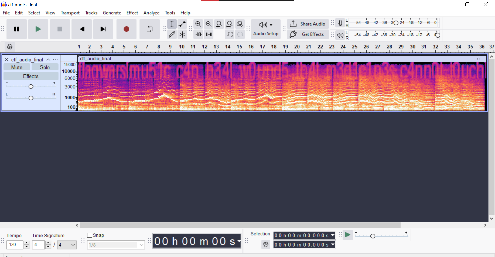

# Challenge name: Echoes of Emotion (100 points)

# Description:
Some melodies feel as if they were composed just for you — tender, mesmerizing, and impossible to forget. The song lingers in your mind, soft and comforting, yet within its notes lies a secret. If your heart truly listens, can you uncover what it holds.

# Solution:
Open the file in audacity and switch to spectrogram view. There comes the flag!

# Flag:
flagwars{mu51c_c4n_h34l_w0und5_th4t_m3d1c1n3s_c4nn0t_t0uch}