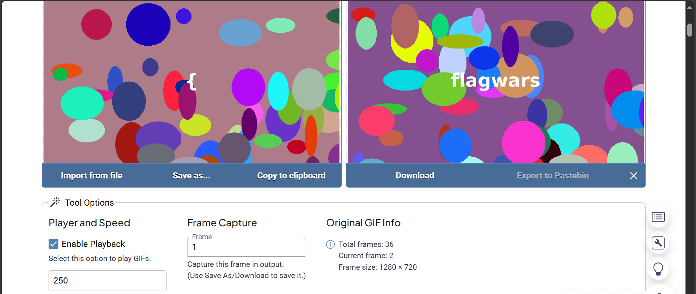
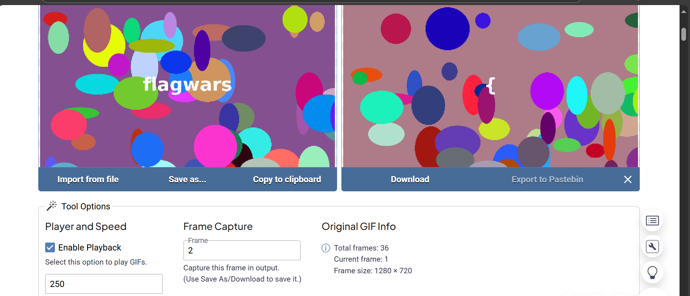

# Frames of Truth (150 points)

## Description:
A strange GIF has surfaced online, shifting and flickering in a way that seems meaningless. Some say secrets hide where the eye can’t follow, and this one is no exception.

Can you uncover what lies beneath the blur? Only those who look closely enough will find the hidden truth.

## Solution:
Go to https://onlinegiftools.com/play-gif and upload your gif file. Change the frame number to view each frame separately.

## Flag:
flagwars{this_is_a_long_hidden_message_that_you_must_extract_frame_by_frame_to_read_it_all}
