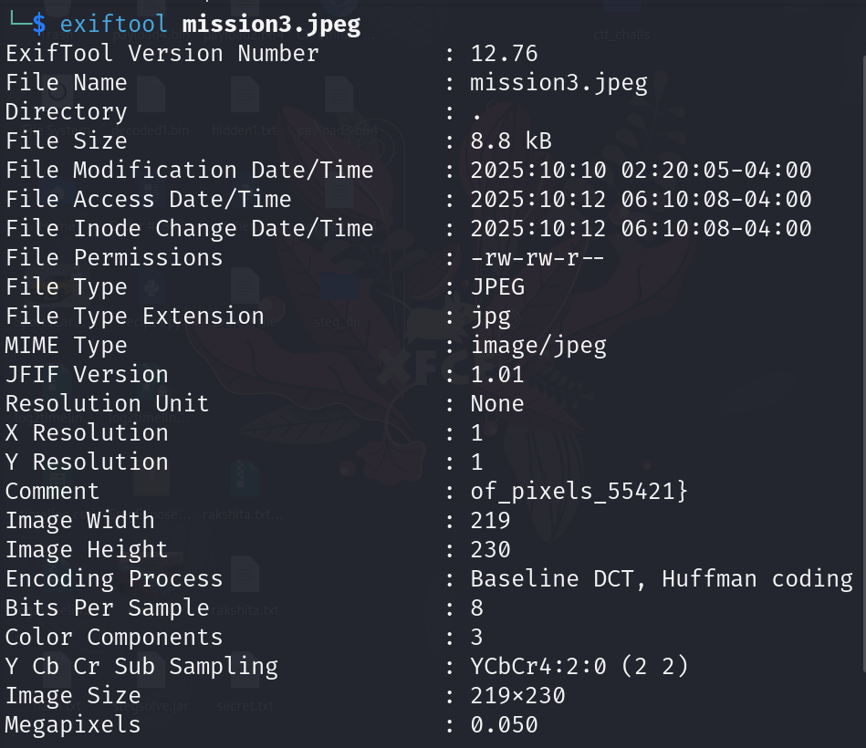
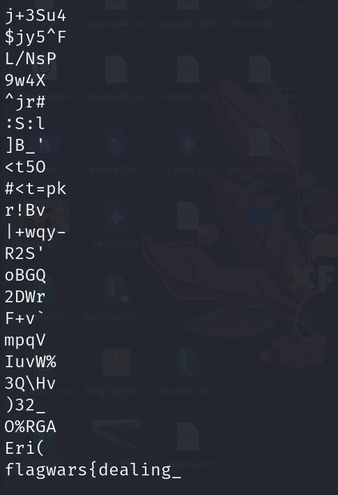
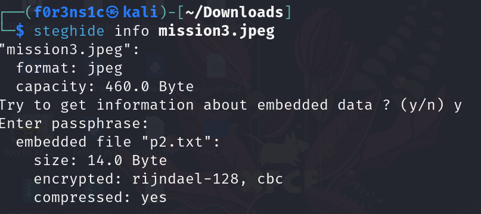
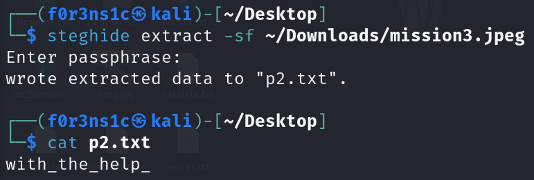

# Did you see it? (300 points)

## Description:
It started as a joke, passed from inbox to inbox.
Nobody noticed anything strange — until someone finally looked closer.
Now you’re holding the same image. Do you see it too?

## Requirements:
VirtualBox, Kali Linux or any online exiftool

## Solution:
Open the file in Kali Linux. And analyse it using exiftool first.

In the comments we can see that the last part of the flag is visible -  which is:
of_pixels_55421}

Then run through strings command on the file, at the end of the strings output we get the first part of the flag.

To get the middle part of the flag, run steghide command on the file to check if anything has been embedded inside the image. It prompts for the passphrase. On opening the text file provided along with this challenge, we find a text which indirectly hints at the word "pixels" being the possible flag. And enter pixels as your passphrase here. 
It reveals that a text file called p2.txt has been embedded inside this image. 

Now extract the text file from the image. Enter the passphrase and your file is extracted. Now read the contents of the text file to get the middle prt of the flag that is, 
with_the_help_

## Flag:	
flagwars{dealing_with_the_help_of_pixels_55421}