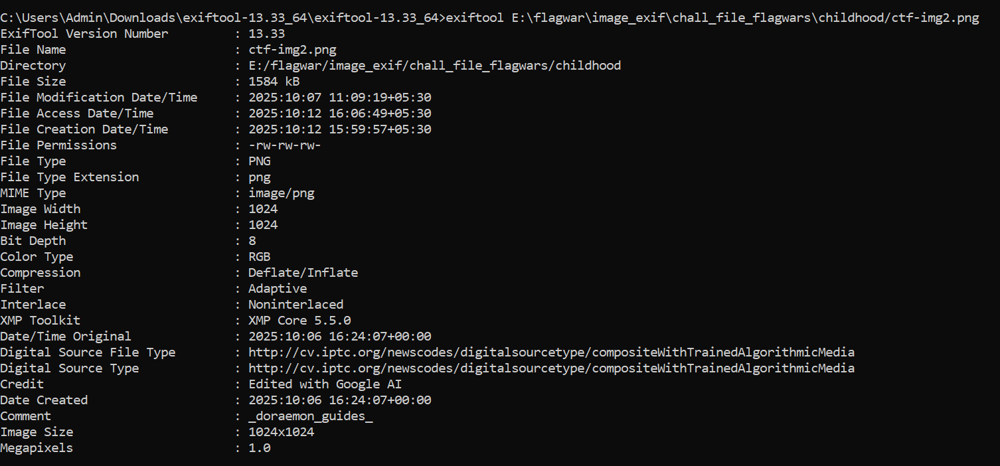
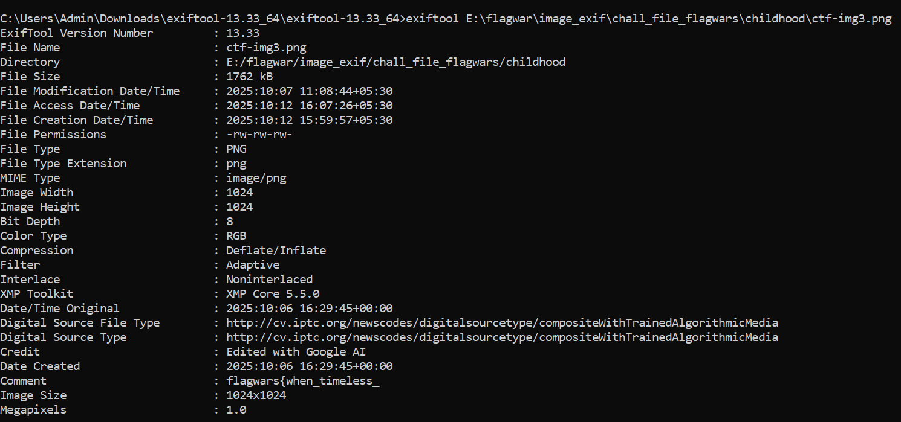
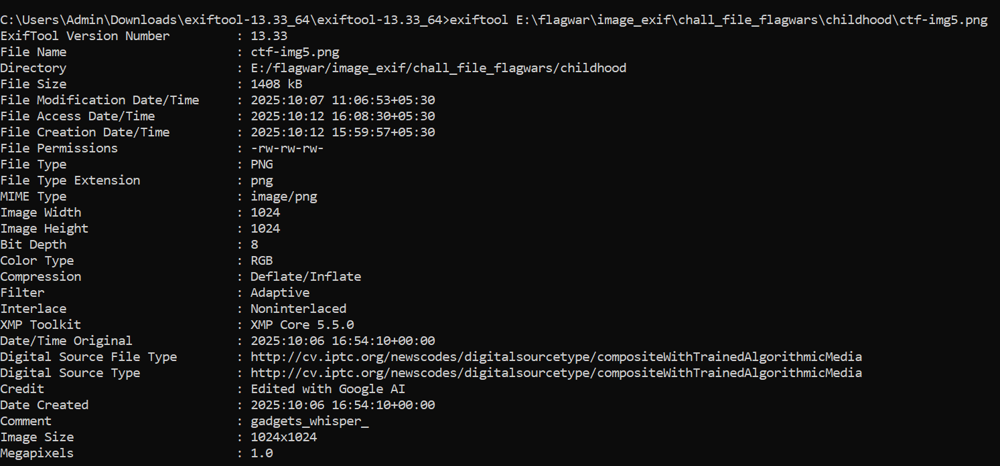

# Picture This (150 points)

## Description:
A dusty zip was found stuffed with snapshots from a childhood afternoon — small, silly frames of two friends forever frozen in mischief. One of them is a red herring; the rest whisper fragments of something more. Each picture keeps a quiet note, and together they tell a secret. Gather the pieces, put them in the right order, and the whole story will reveal itself.

[chall_flagwars_file.zip](https://github.com/user-attachments/files/22881409/chall_flagwars_file.zip)

## Solution:
Open the zip file and move into the childhood folder. You can find 5 images. Run exiftool on each image in Kali Linux and find the flag split into parts and each part present in the comment section of the metadata. 
Alternatively you can also run an online exiftool through the images. For this, go to https://exif.tools/ and upload each image one by one.

We get, _ doraemon_guides _

We get, flagwars{when_timeless_

We get, nobita_home}

We get, gadgets_whisper_

We get, daring_solaces

Now assemble them in the right order to get the full final flag.

## Flag:
flagwars  {when_timeless_gadgets_whisper_daring_solaces_doraemon_guides_nobita_home}
